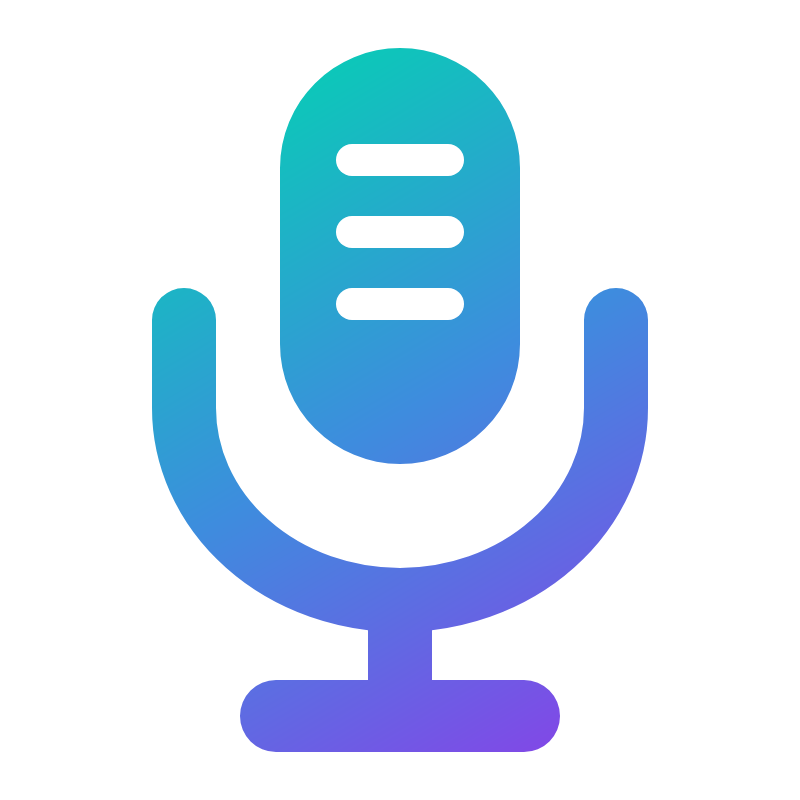

<p align="center">
  
</p>

<h1 align="center">Singularity</h1>

<p align="center"><b>A karaoke system that finds the songs, makes the charts and puts them on the big screen.</b><br>
Windows · .NET 9 · Avalonia · UltraStar-compatible · <code>0.1.0-alpha</code></p>

---

Singularity is a karaoke game in the spirit of UltraStar, with three things UltraStar doesn't do:

1. **It gets the songs itself.** Paste a Spotify link (a song, an album or a whole playlist), or type a list of
   songs. Singularity downloads each one over Soulseek, in lossless quality where it can.
2. **It makes the chart.** If someone has already charted the song on [USDB](https://usdb.animux.de), Singularity
   uses that chart and fits it to your recording. Otherwise its AI worker builds one: it separates the vocals,
   aligns the lyrics word by word and tracks the melody.
3. **It brings the music video.** It finds the official video and syncs it to the song by sound alone. A video that
   doesn't match plays dimmed in the background instead.

Your existing UltraStar song folders work as they are, and songs Singularity makes are standard UltraStar folders
that UltraStar Deluxe, Vocaluxe or Performous can open too.

Singularity grew out of [ORBIT](https://github.com/MeshDigital/Orbit-pure), a Soulseek music manager. It keeps
ORBIT's search, download, library and playlist engine and builds the karaoke game on top.

## What you can do

**Sing**
- Song select with covers, search, preview playback (with the music video) and one card per song; a song charted
  several times (community and AI, solo and duet, album and radio edit) shows its versions on the same card.
- One or two singers: two microphones, or one two-mic karaoke adapter split into left and right. Duets and sing-offs.
- UltraStar scoring out of 10,000 (notes, golden notes, line bonus) with ratings per line; Easy, Medium or Hard;
  singing an octave off is fine. High scores per song, difficulty and singer.
- Sort and filter song select (new, video, duets, community or AI chart, language, year, best score); skip intros;
  a jukebox that plays songs with lyrics and video between singers.
- The music video behind the notes, in sync; or the cover, blurred into a glow of its own colour.
- Real karaoke: remove the original vocals with one click, or for the whole collection overnight, then sing with
  them off, as a quiet guide, or full (V while singing).
- A projector or TV as the stage: the singing goes full screen there while the laptop keeps the controls. Between
  songs the projector shows song select for the room, browsable with arrow keys.
- Microphone setup with a live pitch view and a latency test.

**Add songs**
- One box: a Spotify song, album or playlist link, or songs as `Artist - Title`, one per line.
- Any song can get a new AI chart, or another look for a community chart, from a right-click on its card.
- Every song is searched and downloaded on Soulseek, then gets a community chart (USDB, 3 stars or more, fitted to
  your recording) or an AI chart, its music video, and a quality grade (A+, A, B or "needs checking").
- Optionally every download becomes a karaoke song, and one button turns everything you've downloaded so far into
  karaoke songs. Songs already in your collection are skipped.
- An audio file on your PC works too.

**Keep track**
- Downloads: one line per song, from "Searching Soulseek" to "Ready to sing", with retry.
- Library and Now Playing from ORBIT; a track that is a karaoke song plays its music video.
- Settings for the accounts, folders, adding songs and singing on one page; ORBIT's full settings and download
  center stay available behind an "Advanced" switch.

## How a song is made

```
Spotify link / list ──► ORBIT import ──► Soulseek search + download (FLAC preferred)
                                                    │
                    ┌───────────────────────────────┴──────────────────────────────┐
                    ▼                                                              ▼
   community chart on USDB (≥ 3 stars)                             no usable community chart
   separate vocals (Demucs)                                        lyrics from LRCLIB (or Whisper)
   place the chart on the vocals ──── doesn't fit ───────────────► separate, align, track pitch, tempo
                    │                                                              │
                    └──────────────────────────────┬───────────────────────────────┘
                                                   ▼
                       music video (yt-dlp) synced by sound · cover · quality grade
                                                   ▼
                   song folder: song.txt · audio · vocals/instrumental stems · video · metadata.json
```

Everything is built in a private staging folder and moved into your library in one step, so a half-made song never
shows up, and a failed one leaves nothing behind. The details are in [DOCS/ARCHITECTURE.md](DOCS/ARCHITECTURE.md).

## Getting started

You need Windows 10 or 11 and the [.NET 9 SDK](https://dotnet.microsoft.com/download/dotnet/9.0).

```powershell
git clone https://github.com/MeshDigital/Singularity.git
cd Singularity
dotnet run --project Singularity.csproj
```

Optional, for the full experience:

| For | You need |
|---|---|
| Downloading songs | A Soulseek account (Settings → Accounts) |
| Spotify links | A Spotify developer app (client id and secret) or a Spotify login |
| Community charts | A [USDB](https://usdb.animux.de) account (Settings → Accounts) |
| AI charts and vocal removal | The Python inference worker: Settings → System → **Set up the AI worker**, or `inference/setup.ps1` (Python 3.11, an NVIDIA GPU with 8 GB recommended); see [inference/README.md](inference/README.md) |
| Music videos | [yt-dlp](https://github.com/yt-dlp/yt-dlp) (`winget install yt-dlp.yt-dlp`) and FFmpeg on `PATH` |

Your UltraStar songs are found in `D:\KARAOKE\songs`, or wherever you point Settings → Folders. Songs Singularity
makes go to their own folder, so your collection is only ever read.

The [user guide](DOCS/USER_GUIDE.md) walks through setting up, adding songs and running a karaoke night.

## Documentation

| | |
|---|---|
| [User guide](DOCS/USER_GUIDE.md) | Setup, adding songs, singing, the projector, troubleshooting |
| [Architecture](DOCS/ARCHITECTURE.md) | Projects, the song pipeline, video and chart sync, scoring, data locations |
| [Development](DOCS/DEVELOPMENT.md) | Building, tests, development flags, ChartBench |
| [Roadmap](DOCS/ROADMAP.md) | What's done and what's next, including UltraStar feature parity |
| [Inference worker](inference/README.md) | The Python AI worker: setup, models, protocol |

## Project layout

| Folder | What's in it |
|---|---|
| `Singularity.Contracts/` | Shared formats: the UltraStar `song.txt` reader and writer, song package metadata, the quality grade, the worker protocol |
| `Singularity.Karaoke/` | The game core, without UI: pitch detection, scoring, the song scanner and version grouping, video and chart sync |
| `Services/Karaoke/`, `ViewModels/Karaoke/`, `Views/Avalonia/Karaoke/` | The karaoke app: singing, song select, the stage, adding songs, downloads, settings |
| `Services/`, `ViewModels/`, `Views/` | ORBIT's engine: Soulseek, imports, downloads, library, playback |
| `inference/` | The Python AI worker (stems, lyric alignment, pitch, tempo) |
| `Tests/` | The test suite (about 1,100 tests) |
| `Tools/ChartBench/` | Measures AI charts against human-made ones |

## Status

Alpha. The whole path from a Spotify link to a sung song with video works and has been run on real songs. Measured
on a sample of 50 human-charted songs, AI charts get about 70% of the notes within 100 ms of the human chart and
about 85% of pitches within a semitone; community charts from USDB are better wherever they exist. Not built yet:
the phone companion (singing into your phone), a chart editor and party modes. See the
[roadmap](DOCS/ROADMAP.md).

## Credits

- [ORBIT](https://github.com/MeshDigital/Orbit-pure), which Singularity is built on.
- The [UltraStar](https://usdx.eu) song format and community, and [USDB](https://usdb.animux.de) for its charts.
- [LRCLIB](https://lrclib.net) for synced lyrics.
- [Demucs](https://github.com/facebookresearch/demucs), [faster-whisper](https://github.com/SYSTRAN/faster-whisper),
  [torchaudio's MMS forced aligner](https://pytorch.org/audio/) and SwiftF0 in the AI worker; [yt-dlp](https://github.com/yt-dlp/yt-dlp) and [FFmpeg](https://ffmpeg.org) for media.
- UltraStarKaraokeMaker (MIT) for the chart-making pipeline it is modelled on, and
  [UltraStar-CLI](https://github.com/martiinii/UltraStar-CLI) (MIT) for how USDB pages are read.

## License

No license has been chosen yet; until one is added, all rights are reserved by the authors.
